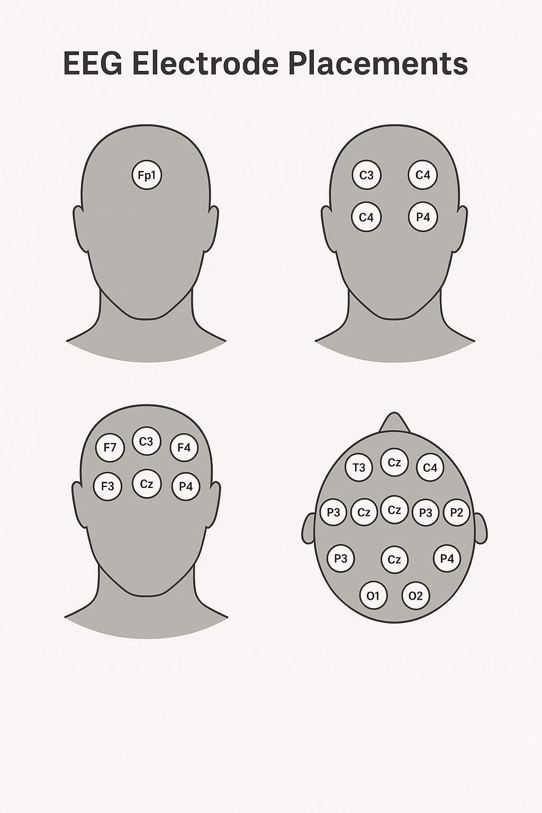

# Getting Started with BCI

### &#x20;What is EEG?

**Electroencephalography (EEG)** is a non-invasive technique used to record the brain's electrical activity through electrodes placed on the scalp. It captures the summed electrical signals produced by neuronal firing, especially from the cerebral cortex.

### How EEG Works (Brief)

* The brain’s neurons communicate via **electrical impulses**.
* When large groups of neurons fire in synchrony, their combined activity can be detected as **brain waves**.
* EEG devices measure these voltage fluctuations in the microvolt range (µV), using **electrodes** typically arranged according to the **10-20 international system**.

***

### Why EEG Matters for BCI

* It's **affordable**, **portable**, and **non-invasive**, making it perfect for practical brain-computer interface projects.
* Unlike MRI or MEG, EEG allows **real-time** signal processing — essential for applications like controlling a robotic arm or triggering a command based on thought.

**EEG** is the most commonly used technique in BCIs due to its portability and affordability, there are several other devices and methods — each with its own advantages and limitations.

### 🧠 Types of EEG Devices (Classified by Use, Form Factor, and Channel Count)

***

#### 🔹 **1. Clinical-Grade EEG Devices**

**✅ Use Case:**

* Hospitals, neurology labs, epilepsy detection, sleep studies

**⚙️ Features:**

* 32–256 channels
* Wet electrodes (gel-based)
* High sampling rate (up to 1kHz+)
* Expensive (₹5–20+ lakhs)

**🛠 Examples:**

* **Natus Medical (Nicolet)**
* **Brain Products GmbH**
* **Compumedics Grael**

***

#### 🔹 **2. Research-Grade EEG Devices**

**✅ Use Case:**

* Neuroscience & BCI research
* Signal decoding, motor imagery studies

**⚙️ Features:**

* 8–64 channels
* High signal quality
* Often support dry or semi-dry electrodes
* Moderate cost (₹1–5 lakhs)

**🛠 Examples:**

* **OpenBCI Cyton/Ganglion**
* **g.tec g.Nautilus**
* **BioSemi ActiveTwo**
* **Emotiv Epoch**

***

#### 🔹 **3. Consumer EEG Devices (BCI-Focused)**

**✅ Use Case:**

* BCI projects, meditation, focus tracking
* Entry-level research or prototyping

**⚙️ Features:**

* 1–14 channels
* Dry electrodes
* Wireless (Bluetooth/USB)
* Affordable (₹10k–₹80k)

**🛠 Examples:**

* **NeuroSky MindWave** – 1 channel, used in toys and apps
* **Emotiv Insight** – 5 channels, good for focus/emotion tracking
* **OpenBCI Ganglion** – 4 channels, open source, hobbyist favorite

***

#### 🔹 **4. Wearable EEG Headsets**

**✅ Use Case:**

* Real-time BCI, mobile apps, neurofeedback, UX research

**⚙️ Features:**

* Lightweight, battery-powered
* Bluetooth or Wi-Fi enabled
* Designed for ease of use

**🛠 Examples:**

* **Muse 2 / Muse S** – Used for meditation and EEG-based sleep monitoring
* **FocusCalm** – Cognitive training & performance feedback
* **Neurable** – BCI headset integrated into VR headsets

| Type              | Channels | Electrodes | Use Case              | Examples                     |
| ----------------- | -------- | ---------- | --------------------- | ---------------------------- |
| Clinical-Grade    | 32–256   | Wet        | Medical, diagnostic   | Natus, Brain Products        |
| Research-Grade    | 8–64     | Wet/Dry    | Neuroscience, BCI     | OpenBCI, g.tec, Emotiv Epoch |
| Consumer          | 1–14     | Dry        | BCI, focus, hobby     | NeuroSky, Emotiv Insight     |
| Wearable/Portable | 4–8      | Dry        | Neurofeedback, mobile | Muse, Neurable, FocusCalm    |

#### ⚠️ Choosing for Your Book Projects

For project-based learning, prototyping, and entry-level BCI:

> ✅ Best starting options:

* **OpenBCI Ganglion** (4 ch, open-source, widely used in BCI)
* **Emotiv Insight** (wireless, 5 ch, good UX)
* **NeuroSky MindWave** (low cost, very beginner-friendly)

A **channel** in EEG refers to **one independent electrical signal path** from a specific electrode (or pair of electrodes) placed on the scalp to the recording system.

> **Each channel = one measurement of brain activity from one location.**

<figure><figcaption>
4, 8, or 16 channel electrode setups
</figcaption></figure>

***

#### 🧪 How It Works Technically

* Electrodes are placed at various points on the scalp (e.g., Fp1, Cz, O2 — following the **10–20 international system**).
* Each electrode picks up voltage fluctuations caused by **neural activity underneath it**.
* The EEG amplifier records these voltages — **one per channel**.
* Some devices record **absolute voltages**; others record **differentials** between pairs of electrodes.

### 🎯 How to Find the Exact Spot for EEG Electrode Placement

You use the **10–20 International Electrode Placement System**, which maps electrode locations using **percentages of head size** — not fixed distances — making it universal across head shapes.

***

#### ✅ Step-by-Step Process

**1. Measure the Head**

Using a soft measuring tape:

* **Nasion → Inion** (front to back)
* **Left preauricular → right preauricular point** (ear to ear across the top)
* **Circumference** of the head (optional, for reference)

**2. Calculate 10% and 20% Points**

* Mark 10% from each end, then 20%, 20%, 20%, and 10% again
* Where these points intersect becomes the electrode position:
  * e.g., **Cz** is the midpoint between nasion-inion and ear-to-ear

**3. Use a Cap (Optional)**

Many EEG caps (like those from OpenBCI or Emotiv) are pre-marked with positions:

* Fp1, Fp2
* F3, F4
* C3, Cz, C4
* P3, P4
* O1, O2

> These match the **standard neuroanatomical lobes**: Frontal, Central, Parietal, Occipital, etc.

***

#### 🧠 What If You Miss the Spot?

**🔻 Small Error (within 1–2 cm):**

* Usually tolerable in consumer BCI devices
* Might cause **reduced signal quality** or misclassification (e.g., left motor vs right motor imagery)
* Noise filtering and machine learning can sometimes compensate

**🚫 Large Error or Misalignment:**

* Can lead to **wrong signals or lower accuracy**
* BCI tasks like SSVEP, motor imagery, or P300 detection may **fail entirely**
* Bad placement can result in:
  * Cross-talk from wrong brain regions
  * Missed event-related potentials
  * Muscle artifact dominance

🛠️ Tools to Help You Place Accurately

| Tool                       | Use Case                                                    |
| -------------------------- | ----------------------------------------------------------- |
| EEG cap with labeled holes | Fast, standardized placement                                |
| Soft tape measure          | DIY head size calculations                                  |
| EEG marker pen             | Marking exact scalp positions                               |
| Digital EEG placement apps | Some vendors offer apps that overlay positions on AR models |

### 🔍 Tip for Your Book Projects

> For consistent placement in your project-based BCI book:

* Add a “DIY EEG placement guide”
* Use clear diagrams of 4-channel and 8-channel positions (e.g., Fp1, F3, C3, Cz, P3, O1)
* Suggest using a labeled cap or printable template

***

### 🧠 Devices Other Than EEG Used in BCI

***

#### 🔬 **1. Electrocorticography (ECoG)**

* **How it works**: Records brain activity directly from the **cerebral cortex** using electrodes placed **under the skull** but **above the brain** (subdural).
* **Invasive**: Yes
* **Use Cases**: High-precision BCIs for speech, limb movement control
* **Pros**: High spatial and temporal resolution
* **Cons**: Requires surgery

***

#### 🧲 **2. Magnetoencephalography (MEG)**

* **How it works**: Detects magnetic fields produced by neuronal activity using highly sensitive sensors (SQUIDs).
* **Invasive**: No
* **Use Cases**: Research-grade brain mapping
* **Pros**: High temporal resolution
* **Cons**: Expensive, non-portable, needs magnetic shielding

***

#### 💨 **3. Functional Near-Infrared Spectroscopy (fNIRS)**

* **How it works**: Measures **blood oxygenation changes** in the brain using near-infrared light (hemodynamic response).
* **Invasive**: No
* **Use Cases**: Attention monitoring, workload estimation, low-speed BCI
* **Pros**: Portable, non-invasive, better than fMRI for field work
* **Cons**: Low temporal resolution, indirect measure of neural activity

***

#### 🧪 **4. Functional Magnetic Resonance Imaging (fMRI)**

* **How it works**: Detects brain activity by measuring changes in blood flow (BOLD signal).
* **Invasive**: No
* **Use Cases**: Research, diagnostic BCI studies
* **Pros**: Excellent spatial resolution
* **Cons**: Immobile, expensive, low temporal resolution, impractical for real-time BCI

***

#### 🧩 **5. Implanted Neural Interfaces (Utah Array, BrainGate, Neuralink)**

* **How it works**: Microwire arrays directly implanted into brain tissue to record action potentials
* **Invasive**: Yes (fully)
* **Use Cases**: Clinical-grade prosthetics, brain typing, motor rehabilitation
* **Pros**: Ultra-high resolution, direct neuron access
* **Cons**: Highly invasive, surgical risk, long-term stability is a challenge

<table><thead><tr><th>Device Type</th><th>Invasiveness</th><th width="175.39990234375">Resolution (Time/Space)</th><th>BCI Use Suitability</th><th>Notes</th></tr></thead><tbody><tr><td><strong>EEG</strong></td><td>Non-invasive</td><td>High / Low</td><td>Excellent</td><td>Most common, low cost</td></tr><tr><td><strong>ECoG</strong></td><td>Semi-invasive</td><td>High / High</td><td>High-end clinical</td><td>Requires craniotomy</td></tr><tr><td><strong>MEG</strong></td><td>Non-invasive</td><td>High / High</td><td>Research</td><td>Bulky and costly</td></tr><tr><td><strong>fNIRS</strong></td><td>Non-invasive</td><td>Low / Moderate</td><td>Moderate</td><td>Easy to wear</td></tr><tr><td><strong>fMRI</strong></td><td>Non-invasive</td><td>Low / High</td><td>Research only</td><td>No real-time use</td></tr><tr><td><strong>Implants</strong></td><td>Fully invasive</td><td>Ultra High / Ultra High</td><td>Advanced BCI</td><td>Used in Neuralink, BrainGate</td></tr></tbody></table>
